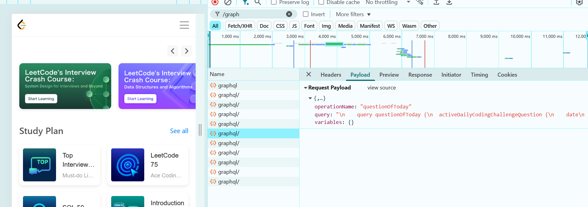

# LeetCode Notifier

[](https://golang.org)
[](LICENSE)

Automatically fetch the daily LeetCode problem and get it delivered to your phone via SMS. Perfect for coding enthusiasts and study groups!

## ⚠️ UPDATE: Textbelt has been banned in few countries
TextBelt Response: {"success":false,"error":"Sorry, free SMS are disabled for this country due to abuse."}

## Features
- Fetches the daily LeetCode problem.
- Sends the problem title and link via SMS using TextBelt.
- Free to use and deploy.

## How It Works
1. The script fetches the daily problem from LeetCode's GraphQL API.
2. It formats the problem title and link into an SMS.
3. The SMS is sent to your phone using TextBelt's free SMS service (https://textbelt.com/)
4. The entire process is automated and runs daily.

I was able to get the graphql query that fetches this question


## Setup
1. Clone the repository:
   ```bash
   https://github.com/mohit-nagaraj/LeetCode-Notifier.git
   ```
2. Replace the phone number in main.go with your own.
3. Deploy using GitHub Actions or Heroku Scheduler.

## License
This project is licensed under the MIT License. See LICENSE for details.

## Contributing
Feel free to open issues or submit pull requests. Contributions are welcome!

Made with ❤️ by Momo